# ~ SmartCalc v1.0 ~

## ~  Инструкция по использованию ~

### ~ Мой разработанный калькулятор выглядит таким образом при начале работы с ним: ~
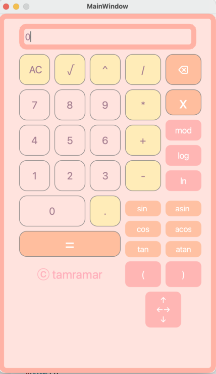 

**1. Чтобы вычислить необходимое выражение - нажмите на допустимые цифры и операции над ними, а затем знак "=".**
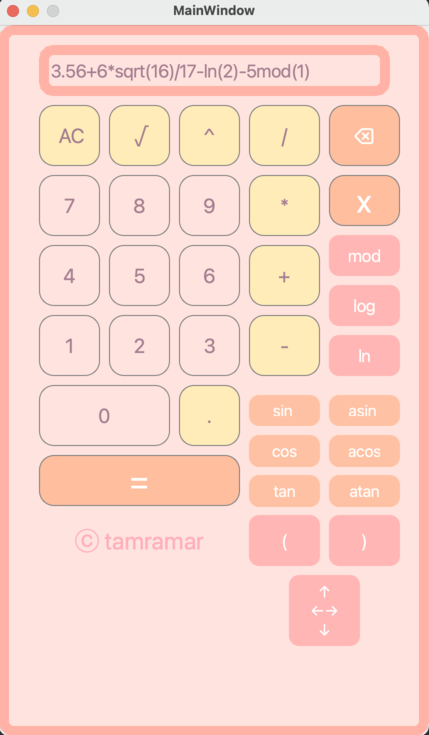 
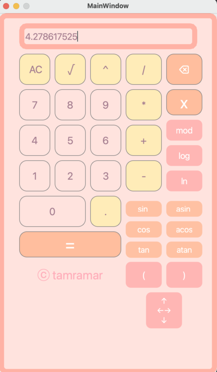  

- На вход принимаются как целые числа, так и вещественные.  

- Поддерживаются такие операции, как:  

    | Оператор | Обозначение |
    | --- | --- |
    | Скобки | "(" ")" |  
    | Сложение | "+" | 
    | Вычитание | "-" |
    | Умножение | "*" |
    | Деление | "/" |  
    | Возведение в степень | "^" |   
    | Остаток от деления | "mod" |   
    | Унарный плюс | "-" |   
    | Унарный минус | "+" |  

- А также тригонометрические вычисления:  

    | Описание функции | Функция |   
    | --- | --- |  
    | Вычисляет косинус | cos(x) |   
    | Вычисляет синус | sin(x) |  
    | Вычисляет тангенс | tan(x) |  
    | Вычисляет арккосинус | acos(x) | 
    | Вычисляет арксинус | asin(x) | 
    | Вычисляет арктангенс | atan(x) |
    | Вычисляет квадратный корень | sqrt(x) |
    | Вычисляет натуральный логарифм | ln(x) | 
    | Вычисляет десятичный логарифм | log(x) |     

- Kнопка AC - удалит все, что было написано и будет принимать значение заново.  

- Кнопка "⌦" - удаляет один последний символ

- Если выражение будет введено некорректно, то после нажатия на кнопку равно, будет выведен сигнал об ошибке "Error".    

**Ошибками будут считаться:**
1. Несколько точек в одном числе 
2. При вычислении остатка перед значением mod не будет написана цифра 
3. После скобки ")" нет оператора
4. Перед "(" нет оператора 
5. Введено несколько операторов подряд 
6. Количество открывающихся скобок не равно закрывающимся 
7. После оператора не введена цифра 
8. После точки написана не цифра
9. Перед операторами sqrt, sin, cos, tan, asin, acos, atan написан оператор  

Например:  

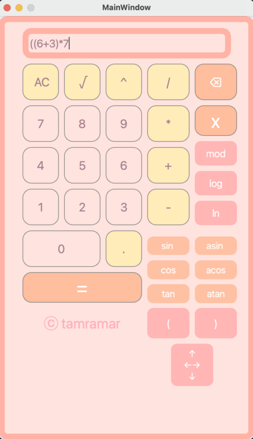 
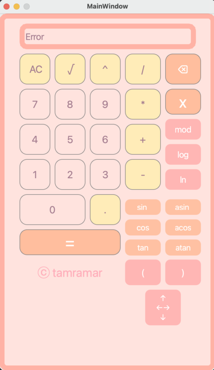 
 
**2. Также поддерживается вычисление с X:**  

Нужно ввести выражение и в нужном месте нажать на X, после чего появится окошко, где нужно написать значение X  

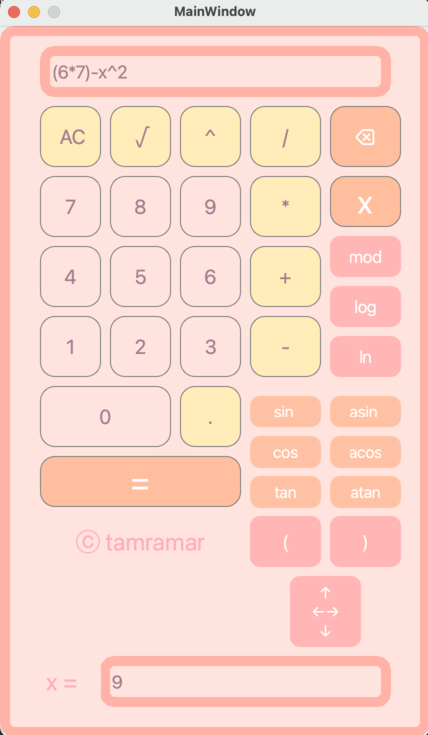 
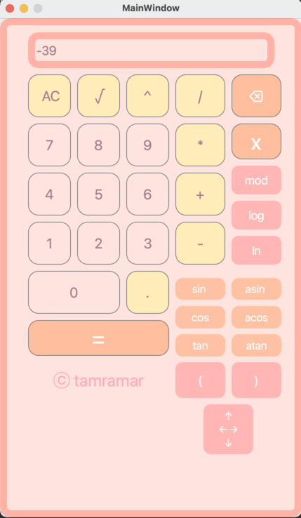 

**3. Также поддерживается отрисовка графика выражения с использованием X:**  

Для этого введите выражение с x, но не пишите значение x. После чего нажмите на кнопку со стрелочками, она откроет окно с графиком. Но изначально он пустой, чтобы он отобразил ваш график нажмите "NEW", чтобы сделать график вновь пустым нажмите "CLEAR".  

Вы также можете изменить размер xmin, xmax, ymin, ymax, чтобы изменить видимости областей графика.  

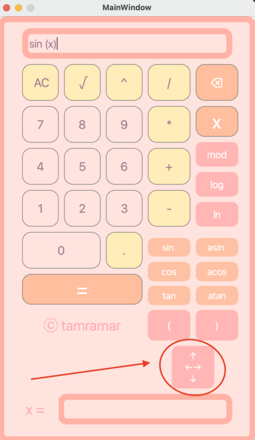 
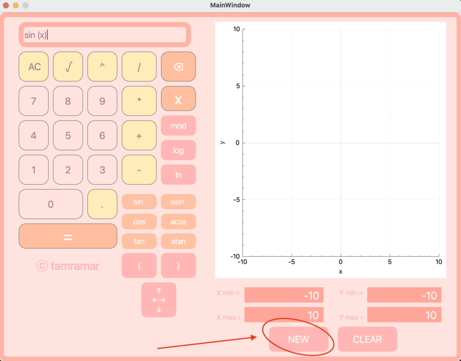
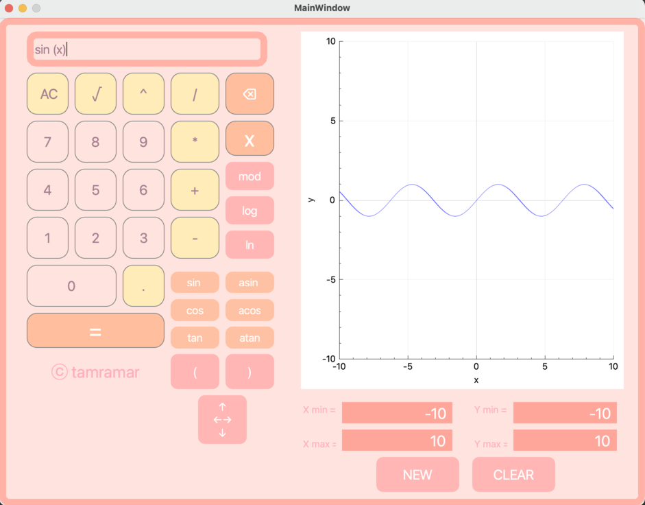

**4. Также поддерживается кредитный калькулятор:**
Чтобы перейти в его режим необходимо нажать на кнопку **"Credit"**  

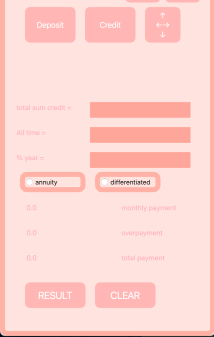  

Впишите необходимые данные, а точнее общую сумму кредита, срок, процентную ставку и выберите тип кредита(аннуитетный или дифференцированный) и нажмите **"RESULT"**.  

В итоге вы получите ежемесячный платеж по кредиту, переплату по кредиту и общую выплату.  

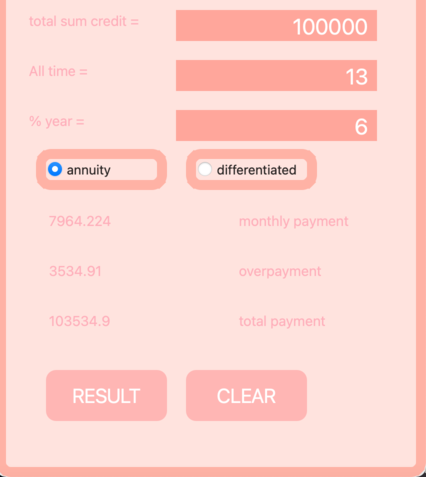  
Если хотите начать расчет заново, нажмите **"CLEAR"**, все поля будут стерты.  

Чтобы выйти из данного режима и перейти к депозитному или графу, снова нажмите на кнопку **"Credit"**.  

**4. Также поддерживается депозитный калькулятор калькулятор:**
Чтобы перейти в его режим необходимо нажать на кнопку **"Deposit"**  

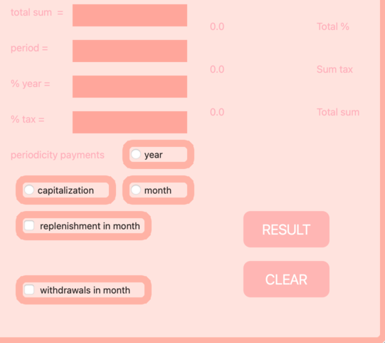  

Впишите необходимые данные, а точнее сумму вклада, срок, процентную ставку, налоговую ставку, выберите как будет осуществляться выплаты(капитализацией, то есть сумма процентов кладется на вклад или выплачиваетсяраз в месяц или выплачивается раз в год), если необходимо нажмите пополнения(каждый месяц) и в появившемся окне напишите сумму, аналогично можете сделать со снятиями(каждый месяц). Два последних пункта необязательны к расчетам. И нажмите **"RESULT"**.  

В итоге вы получите начисленные проценты, сумму налога и общу сумму на вкладе к концу срока.  

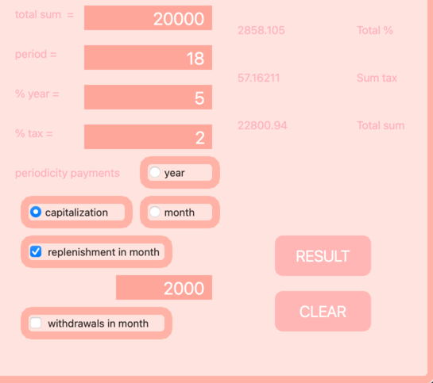  
Если хотите начать расчет заново, нажмите **"CLEAR"**, все поля будут стерты.  

Чтобы выйти из данного режима и перейти к депозитному или графу, снова нажмите на кнопку **"Credit"**.  
